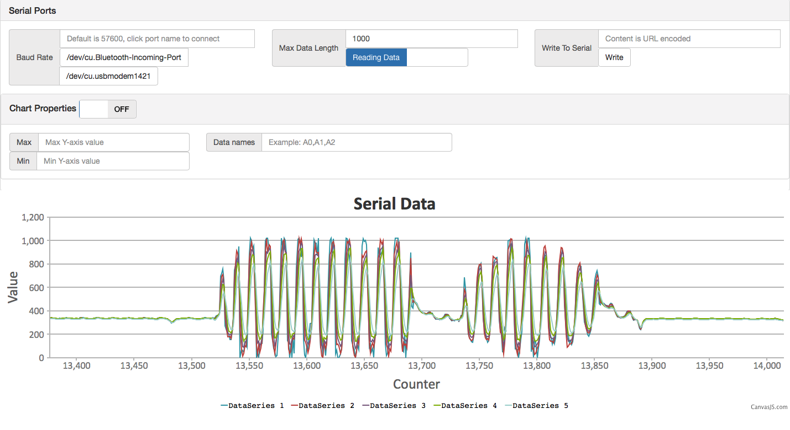

# DFSerialChart

Plotting data from serial port
!



Demo with Genuino accelerometer:

[Youtube Demo](https://youtu.be/G43BR6q5kJI)

## Prerequisites

You need `Node` version `4.4.0` or above.


You might need to run `npm install` if the package does not run correctly out of the box. This is related to the `serialport` module.


## Installation

For Linux users, you might need to:

```javascript
npm install
```


## Usage

### Prepare your board

Sample Arduino Code:

```C
void setup() {
  // put your setup code here, to run once:
  Serial.begin(57600);
}

void loop() {
  // put your main code here, to run repeatedly:
  Serial.print(analogRead(A0));
  Serial.print(",");
  Serial.print(analogRead(A1));
  Serial.print(",");
  Serial.print(analogRead(A2));
  Serial.print(",");
  Serial.print(analogRead(A3));
  Serial.print(",");
  Serial.println(analogRead(A4));
  delay(100);
}
```

The protocol grabs values in comma seperated values(CSV) format.  


### Start service

For windows users, double click

```
start.bat
```

For linux/Unix based systems and Mac systems, run
```
start.sh
```

Then navigate your browser to http://localhost:23456, fill in the baud rate then click one of the port button listed.

You can change your baud rate for your serial device, then click on the device name to reconnect.

You can rename your data series, define your own y-axis range.

You can refresh your web page to get rid of any old data you don't want to see.

If data is not refreshing, try unplug and replug, and turning it off and on again. Old tricks still work.
